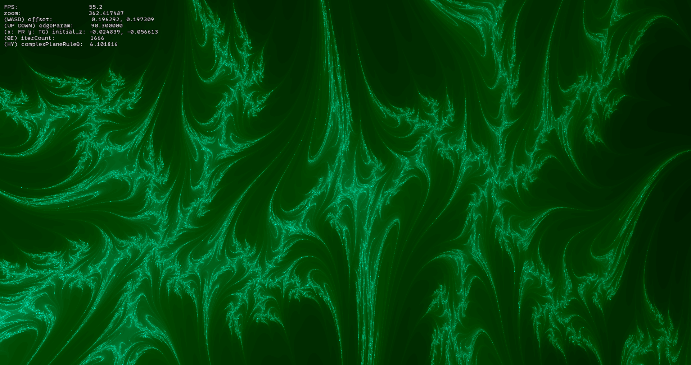
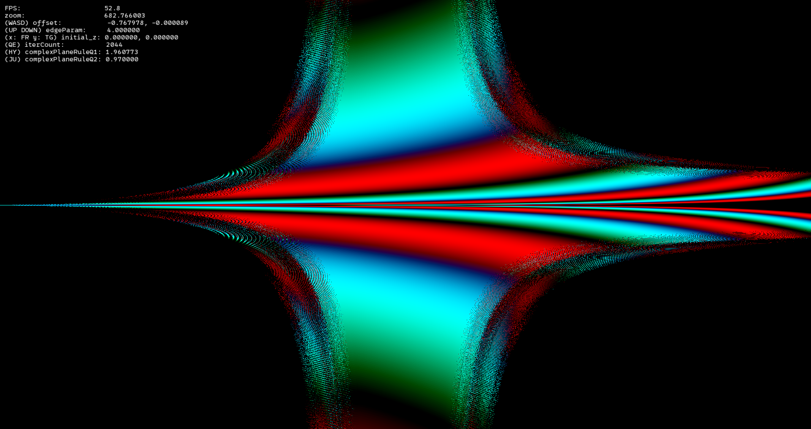
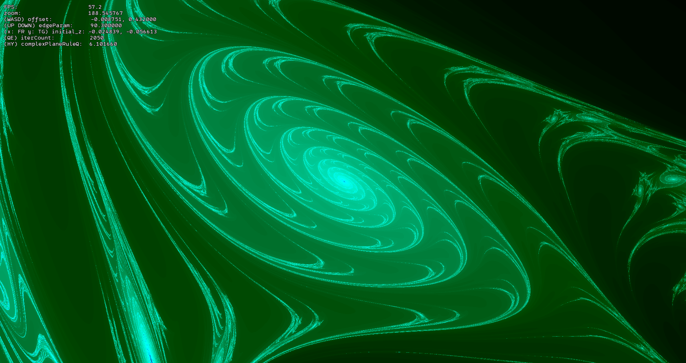
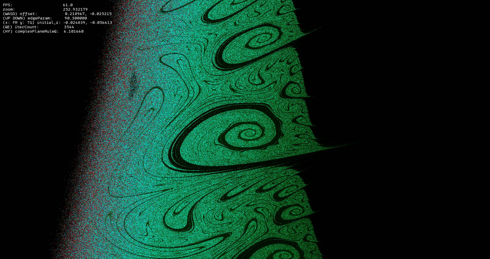
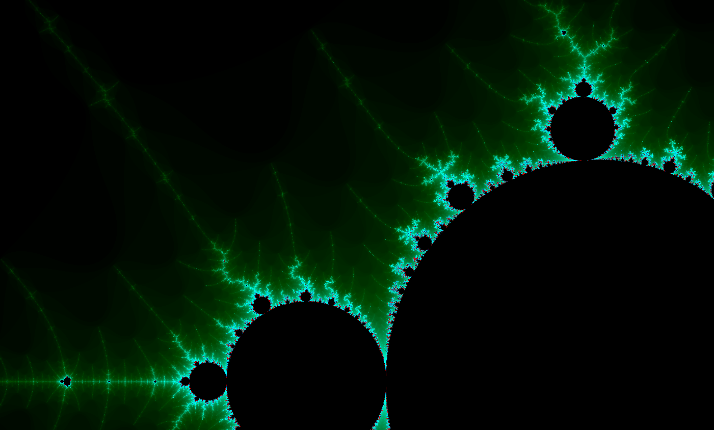
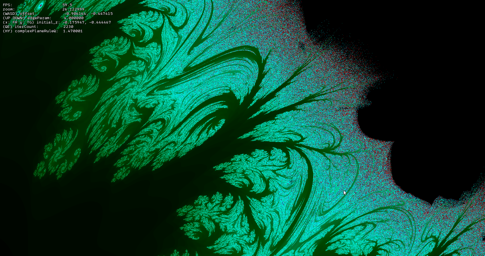

# Mandelbrot Set - SFML + GLSL

An interactive real-time Mandelbrot set explorer rendered entirely on the GPU via a GLSL fragment shader, with a C++ + SFML 3 host application.

---

## The most interesting samples

|  |  |
|---|-----------------------------------------------------------------------|
|  |  |
|  |  |

---

## Controls

| Key / Input | Action |
|---|---|
| **Mouse Wheel** | Zoom in / out (centred on cursor) |
| **W A S D** | Pan up / left / down / right |
| **↑ / ↓** | Increase / decrease escape-radius (`edgeParam`) |
| **R / F** | Increase / decrease `initial_z.x` |
| **T / G** | Increase / decrease `initial_z.y` |
| **Y / H** | Increase / decrease `complexPlaneRuleQ1` (controls `2·x·y` coefficient) |
| **U / J** | Increase / decrease `complexPlaneRuleQ2` (controls `x²-y²` coefficient) |
| **E / Q** | Increase / decrease iteration count |
| **Backspace** | Reset all parameters to defaults |
| **F2** | Save screenshot to `screenshot.png` |

---

## Building

### Prerequisites

| Tool | Minimum version |
|---|---|
| CMake | 3.20 |
| C++ compiler | C++17 (MSVC, GCC, Clang) |
| SFML | 3.x |

> **Note (Windows):** the project links against `dwmapi` for the dark title bar. This is Windows-only; you may need to remove that block from `main.cpp` when building on Linux/macOS.

### Steps

```bash
git clone https://github.com/Qosua/MandelbrotSet_SFML-GLSL.git
cd MandelbrotSet_SFML-GLSL

cmake -B build -DCMAKE_BUILD_TYPE=Release
cmake --build build --config Release
```

The compiled binary and all required SFML DLLs (on Windows) will be placed in the build output directory. Copy `mandelbrotShader.frag` and the font file `0xProtoNerdFont-Regular.ttf` next to the executable before running.

---

## Project Structure

```
MandelbrotSet_SFML-GLSL/
├── main.cpp                  # Application entry point — window, events, uniforms
├── mandelbrotShader.frag     # GLSL fragment shader — fractal maths & colouring
├── CMakeLists.txt            # CMake build script
└── gallery/                  # Screenshots and preview images
```

---

## License

This project is licensed under the **MIT License** - see the [LICENSE](LICENSE) file for details.
